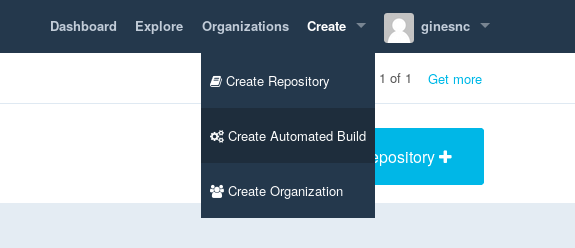
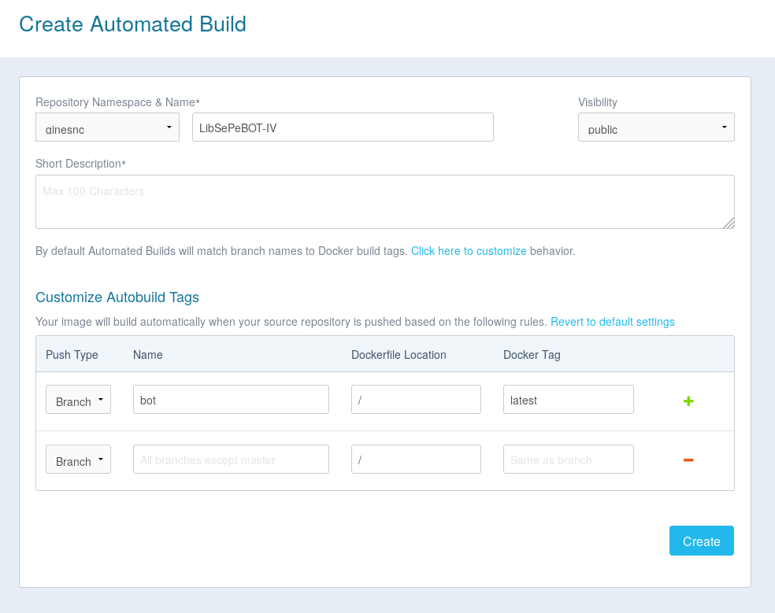

# Despliegue en Docker

### Despliegue automatico
Para poder hacer el despliegue automático en Docker Hub cuando se hace un push hay que crear un repositorio que lo permita. Para eso se hacer clic en _Create_ y en  el menus desplegable se elige la segunda opción: _Create Automated Build_.

El siguiente paso es elegir desde donde se quiere hacer el despliegue automático, GitHub o Bitbucker. En mi caso con GitHub, que ya tenía asociada la cuenta. Ahora es el momento de elegir el repositorio del cual se hace el despliegue automático y por último se configura el repositorio de Docker Hub, escribiendo una descripción del mismo, poniendo que visibilidad tendrá (publica o privada). Si el Dockerfile se encuentra en otra rama que no es la master u otra localización hay que indicarlo.

El Dockerfile es un fichero en el cual indicamos como se crea el contenedor y que debe ejecutar.

    FROM python:3

    WORKDIR /usr/src/app

    COPY . .
    RUN pip install --no-cache-dir -r requirements.txt

    ENV PORT 80
    CMD [ "python", "./app.py" ]

    EXPOSE 80

En este caso se crea un contenedor con la imagen python oficial. He elegido esta porque se hace mas rápido el despliegue, puesto que no se tiene que poner en marcha un sistema operativo e instalar posteriormente el lenguaje y las dependencias necesarias.

### Despliegue contededor y herokuapp

para llevar a cabo esta tarea hayq eu crear un nuevo fichero heroku.yml, en el cual se indica que se tiene que uasr, y yo he pueste que se use docker y el fichero docker file, asi se consigue se se despliegue desde docker en heroku al hacer push del proyecto local.

El contenido de mi fichero es:

    build:
      docker:
        web: Dockerfile

Donde se indica la imagen docker a compilar por el proceso web. En mi caso se compila el Dockerfile. Si no se pone la seccion run estoy indicando que se use el CMD del Dockerfile.
