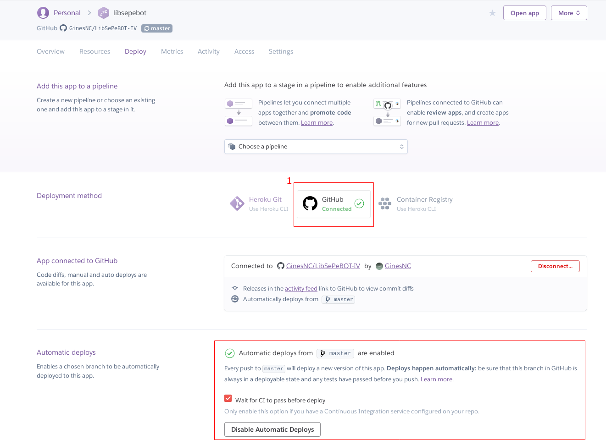

# Despliegue en Heroku

### Pasos
- Clonar el repositorio que se quiere desplegar en Heroku.
      git clone https://github.com/GinesNC/LibSePeBOT-IV

- Crear la aplicación Heroku en el directorio donde se clonó el repositorio que se quiere desplegar.

- Crear los ficheros: **runtime.txt** para especificar la versión de Python, **requirements.txt** para indicar las dependencias necesarias para que se ejecute la app y el **Procfile**. Este último se usa para indicar el tipo de proceso y el comando que debe ejecutar al iniciarse. En este caso, el contenido del **Procfile** es: `web: python3 app.py`, donde indico que es un proceso web para poder recibir tráfico HTTP y como comando que se ejecute el script python, llamado _app.py_, que arranca esta aplicación hecha en CherryPy.

### Despliegue automático al hacer git push

Para conseguir esto hay que configurarlo en la pestaña _Deploy_ de la aplicación en Heroku.

Primero hay que asociar la aplicación al repositorio correspondiente de GitHub. Esto se consigue pulsando el botón que en la captura se indica con un número 1. Una vez pulsado pide que se introduzca el repositorio que se conectará con la aplicación y aparece una opción más que está deshabilitada. Esta es la que hay que habilitar para permitir el despliegue automático tras hacer git push y pasar los test del CI en el que se haya hecho, esto último si se ha marcado el check.
