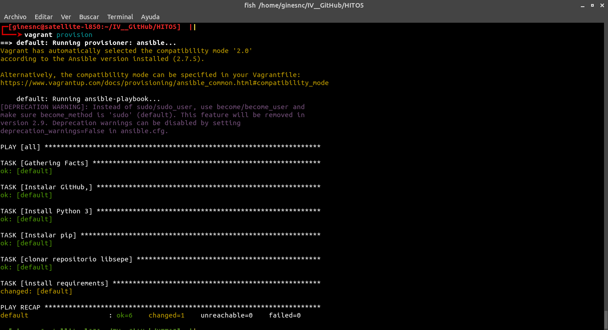

# Provisionamiento, despliegue y ejecución automática

Las configuraciones necesarias para conseguir esto son:

## Configuración local

En primer lugar para un despliegue desde cero hay que configurar varias cosas. Una de ellas es el entorno local, en el cual hay que instalar Vagrant y Azure CLI. Hacer login en Azure, establecer la suscripción con la que se va a trabajar y crear el directorio activo de azure (ADD).

Con `az login` se hace el login en Azure y muestra las suscripciones disponibles.

Tras esto y aunque ya está establecida por defecto, pongo la que está activa:

Ahora se crea el ADD con acceso a la cuenta de Azure y a la suscripción correspondiente.

    az ad sp create-for-rbac

Tras esta ejecución devuelve un *appID* de la aplicación, un password para ese *appID* y un *tenant*. Estos valores son los que se deben poner en  `azure.client_id`,`azure.client_secret`y `azure.tenant_id` del Vagrantfile.

## Configuración del provisionamiento con Ansible

En el siguiente paso es crear el fichero para realizar el provisionamiento. En el cual se indicará todo lo que la máquina tiene que tener instalado. Con ayuda de la [documentación oficial](https://docs.ansible.com/ansible/latest/user_guide/playbooks.html) he realizado este *playbook.yml*:

    - hosts: all
      remote_user: vagrant

      tasks:

      - name: Instalar GitHub,
        sudo: true
        apt:
          name: git
          state: latest

      - name: Install Python 3
        sudo: true
        apt:
          name: python3
          state: latest
          update_cache: yes

      - name: Instalar pip
        sudo: true
        apt:
          name: python3-pip
          state: latest
          update_cache: yes

      - name: clonar repositorio libsepe
        sudo: false
        git :
          repo: https://github.com/GinesNC/LibSePeBOT-IV.git
          dest: /home/vagrant/LibSePeBOT-IV
          force: yes

      - name: install requirements
        sudo: yes
        command: pip3 install -r /home/vagrant/LibSePeBOT-IV/requirements.txt

Donde indico que se haga para todos los host y que el usuario *vagrant* será el encargado de ejecutar las tareas. Esas tareas están especificadas en la sección *task*, donde instalo _git, python3, pip3_, clono el repositorio e instalo todas las dependencias de mi aplicación que se encuentran en *requirements.txt*.

Con `state: latest` se indica que el paquete a instalar tiene que estar en la última versión disponible, si ya se encuentra no hace nada.

En el caso de clonar el repositorio de GitHub, Ansible cuenta con el [modulo *git*](https://docs.ansible.com/ansible/latest/modules/git_module.html)  que facilita esta tarea.

Cuando se realiza el provisionamiento muestra lo siguiente:

Cuando aparece _changed_ indica que se ha cambiado y con _ok_ que se mantiene lo que ya estaba.

# Configuración Vagrant

Hay que configurar el _Vagrantfile_ el cual para hacerlo me he ayudado del repositorio en [GitHub de azure](https://github.com/Azure/vagrant-azure).

      Vagrant.configure('2') do |config|
        config.vm.box = 'azure-lsp'

        config.ssh.private_key_path = '~/.ssh/id_rsa'
        config.vm.provider :azure do |azure, override|

          azure.tenant_id = "4fa7xxxx-xxxx-xxxx-xxxx-xxxxe8e1d1cd"
          azure.client_id = "21e9xxxx-xxxx-xxxx-xxxx-xxxx10c59656"
          azure.client_secret ="dcacxxxx-xxxx-xxxx-xxxx-xxxx23322cef"
          azure.subscription_id = "45aexxxx-xxxx-xxxx-xxxx-xxxx8f9cf14f"

          azure.vm_name = "libsepebot"
          azure.vm_size = "Standard_B1s"
          azure.location = "northeurope"
          azure.admin_username = "libsepe_admin"
          azure.vm_password = 'ClavE'

        end

        config.vm.provision "ansible" do |ansible|
          ansible.playbook = "playbook.yml"
        end

      end

Para empezar `config.vm.box = 'azure-lsp'` es el nombre de la box que he añadido, como se añade lo explico después. Con `config.ssh.private_key_path` se establece la ruta donde se encuentra la clave para poder realizar la conexión mediante `ssh`. Las siguientes lineas son las claves obtenidas cuando se establece el ADD.

Las siguientes lineas son la configuración de la máquina, como el nombre, que se establece con la variable `azure.vm_name`. He elegido el tamaño básico, ya que el proyecto no requiere de muchos recursos. También he añadido un usuario con su clave y por último he establecido el servidor de _northeurope_ ya que he comparado precios y este era un poco más barato con respecto al de _westeurope_.

Como no indico el SO de la máquina se instalará el linux por defecto, que es un _Ubuntu Server_ en la versión _16.04.5_

Para que se haga el provisionamiento he usado Ansible y el *playbook.yml* descrito antes.

Una vez hecho y antes de hacer un `vagrnt up`, hay que añadir una máquina ficticia que no contiene nada y registra a Azure como proveedor. El nombre que le he puesto es `azure-lsp`. Esto se hace con:

      vagrant box add azure-lsp https://github.com/azure/vagrant-azure/raw/v2.0/dummy.box --provider azure

Una vez creada se instala el pugling de Azure con `vagrant plugin install vagrant-azure` y se  levanta la máquina con `vagrant up --provider=azure`. Esto creará la máquina y realizará el provisionamiento especificado en el *playbook.yml*.

Si posteriormente se realizan cambios en en el *playbook.yml* se pueden aplicar con `vagrant provision`.

## Ejecución automática

Para la ejecución he usado Fabric y para el *fabfile.py* me he ayudado de la [documentación oficial](http://docs.fabfile.org/en/2.4/getting-started.html#run-commands-via-connections-and-run). Mi fichero ha quedado así:

    from fabric.api import run

    def runApp():

         # Iniciamos el servicio web
         run('sudo python3 /home/vagrant/LibSePeBOT-IV/app.py')

    def updateApp():

        run("rm -rf /home/vagrant/LibSePeBOT-IV/")

        run("git clone https://github.com/GinesNC/LibSePeBOT-IV.git /home/vagrant/LibSePeBOT-IV")

Donde se pone en funcionamiento la aplicación con `runApp()` o se puede actualizar con `updateApp()`.

Esto se puede hacer con la herramienta de Fabric, que es `fab` y se ejecutaría de esta forma:

      fab -H vagrant@104.41.225.1212 runApp   

Si el *fabfile.py* está en el mismo directorio. Pero si se encuentra en otro lugar hay que especificarlo con la opción `-f RUTA/fabfile.py`

## Configuración de la máquina para mostrar contenido

Por último para que funcione el servicio correctamente hay que abrir el puerto correspondiente, en este caso el 80. Para eso se hace desde la página web de administración de Azure. Se hace desde *Redes* en el apartado de Configuración y se da a *Agregar regla de puerto ...*(el botón en azul), esto hay que hacerlo tanto para el puerto de entrada como de salida.

Para añadir la regla se rellena con lo correspondiente, en el caso de un puerto es como se muestra en la siguiente imagen:

## Y para finalizar

En las siguientes capturas se puede ver como se arranca el servicio y como se muestra que funciona.

